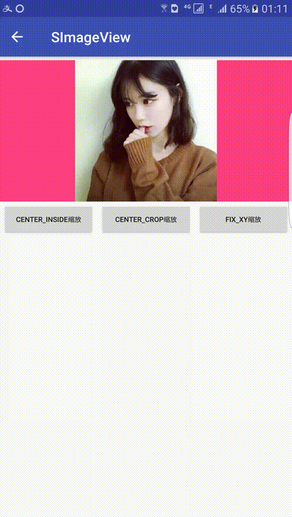

# SImageView
◀️想做一个好厉害的控件

## 控件说明

这是一个相对`ImageView`功能的扩展的控件, 但是没有继承`ImageView`直接继承的`View`. 比如`QQ群组头像`,`微信群组头像`, `设置描边`, `设置圆角矩形头像`,`圆形头像`等. 直接设置即可.  对于`多个图片的排列`和`图片的具体显示`进行了接口分离. 可以自定义实现任何排列效果和显示效果. 

目前只完成了第一阶段. 

* `第一阶段(已完成)`: 完成开发常用的头像处理效果功能集合. 并对`onMeasure``padding`等进行处理, 实现一个可以工作的类. 
* `第二阶段(下个礼拜吧)`: 支持图片网络地址设置, 相当于内置了图片缓存策略. 这样可以省去一些`图片加载库的依赖`如果项目中对图片的依赖比较严重, 对性能要求高的. 可能还得使用一些高性能的库如`Fresco`. 但大公司可能会有时间去自己实现的. 
* `第三阶段(没想好..)`: 做一些性能优化吧


废话太多了.... 抱歉, 看效果吧


## 效果展示

图片可能比较大, 如果不出现, 刷新页面试试或者多等一会.





## 使用说明

### xml声明方式


```xml
<LinearLayout xmlns:android="http://schemas.android.com/apk/res/android"
    xmlns:app="http://schemas.android.com/apk/res-auto"
    android:orientation="vertical"
    android:layout_width="match_parent"
    android:layout_height="match_parent">
    
    <!--范例-->
    <com.szysky.customize.siv.SImageView
       android:id="@+id/siv_main"
       android:background="@color/colorAccent"
       android:layout_width="match_parent"
       android:layout_height="200dp"
       app:displayType="rect"
       app:border_color="@color/colorPrimary"
       app:border_width="1dp"
       app:img="@mipmap/ic_1"
       app:scaleType="fix_XY"/>
       
</LinearLayout>
```

`属性说明`

* `displayType` 设置控件中的图片要以什么类型显示. 可选值如下:
    * `circle`: 圆形图片. (控件的默认值)
    * `rect`: 矩形图片.
    * `round_rect`: 圆角矩形图片.
    * `oval`: 椭圆形图片
    * `five_pointed_star`: 五角星形图片
* `border_color"` 图片描边颜色. 只有当`border_width>0`的时候才有效. 默认是**黑色**.
* `border_width` 图片描边的宽度. 默认值为`0`, 不显示描边.
* `img` 前景图片, 以上所有的效果, 都是对前景图片进行操作处理.
* `scaleType` 类似于`ImageView`的图片缩放选择. 只有当`displayType="rect"`是矩形, 并且`border_width=0dp`条件下才有效果. 其余场景无意义.可选值如下:
    * `center_inside` : 保持图片的完整性缩放, 可能会留白, 图片比例不变
    * `center_crop`  : 保持控件全部被图片填充. 图片部分可能丢失, 图片比例不变.
    * `fix_XY` : 保持图片的完整性并且控件被全部填充. 图片不会丢失, 不会留白. 图片比例会改变.
    
### 代码设置

以下是常用方法, 

```java
SImageView sImageView = (SImageView) itemView.findViewById(R.id.siv);

// 设置描边颜色
sImageView.setBorderColor(Color.GREEN);

// 设置描边宽度 单位dp值
sImageView.setBorderWidth(1);

 // 设置图片显示类型 
 // 可设置类型: SImageView.TYPE_CIRCLE(默认), SImageView.TYPE_OVAL,     
 //           SImageView.TYPE_RECT, SImageView.TYPE_ROUND_RECT, 
 //           SImageView.TYPE_FIVE_POINTED_STAR
 sImageView.setDisplayShape(SImageView.TYPE_ROUND_RECT);
 
 // 设置图片的缩放类型, 只有显示类型为矩形, 并且描边宽度为0. 才有效果. 区别在xml中有说明
 // 可选类型3种:SCALE_TYPE_CENTER_INSIDE(默认), 
 //           SCALE_TYPE_FIX_XY ,SCALE_TYPE_CENTER_CROP
 mSImageView.setScaleType(SImageView.SCALE_TYPE_CENTER_INSIDE);
 
 // 设置微信群组样式显示.  (可以自定义measure测量排列规则)替换measure测量策略如下:
 // 默认为qq群组的测量策略. 只要设置图片时传入多张图片的集合即可.
sImageView.setLayoutManager(new WeChatLayoutManager(context));

// 设置图片
sImageView.setImages(List<Bitmap>); // 接收一个图片集合, 实现qq群组或者微信群组效果
sImageView.setIdRes(id);            // 接收图片资源id
sImageView.setDrawable(Drawable);   // 接收一个Drawable对象
sImageView.setBitmap(Bitmap);       // 接收一个图片的bitmap

```

还有一些对外的方法:

| 方法名称 | 参数说明| 方法作用 |
|---|---|---|
|`setCloseNormalOnePicLoad()`|布尔值|设置`true`可以强制关闭一张图片时候的默认单张图片处理规则, 而由`测量接口`,`绘制显示接口`处理.|
|`setOvalRatio()`|float类型, 椭圆的宽高比值(必须大于0)|在`单张图片`并且`椭圆类型`显示时, 设置椭圆的显示的宽高比例|
|`setRectRoundRadius()`|float类型, 设置范围0~2,默认1|在`单张图片`并且`圆角矩形类型`显示时, 设置圆角的弧度大小|
|`setDrawStrategy()`||可参考下面的扩展实现, 用来设置自定义图片实现策略|
|`setLayoutManager()`||可参考下面的扩展实现, 用来设置自定义或替换 图片的排列分布规则|

对应的`getter()`方法省略. 


### 扩展实现

> 控件实现了`measure测量布局`和`draw具体绘图实现`的功能分离. 你可以任意实现排列规则, 和具体的绘图显示的规则. 

### 自定义measure测量布局

布局测量接口`ILayoutManager`. 相当于`RecyclerView`设置布局管理器. 或者`View#onMeasure()`的作用. 

目前内置了2种布局来实现多张图片的排列.

* `QQLayoutManager`: 控件默认排列规则, 效果类似于`qq群组头像`,最大支持`5`张图片
* `WeChatLayoutManager`: 效果类似于`微信群组头像`, 最大支持`9`张图片

通过`setLayoutManager(ILayoutManager)`来进行测量规则的具体实现类. 

默认情况下, 如果控件只设置了一张图片是不会走`测量的流程`. 如果需要一张图片时也需要不规则的排布. 那么通过`SImageView#setCloseNormalOnePicLoad(true)`. 强制关闭. 

自定义实现: 实现`ILayoutManager`接口并在`calculate()`实现具体的排列效果. 并返回一个子图片的位置信息集合. 接口如下. 可参考已经实现的两个类.


```java
public interface ILayoutManager {

    /**
     * 布局measure排列计算方法, 具体规则由子类实现
     *
     * @param viewWidth 控件的宽
     * @param viewHeight 控件的高
     * @param viewNum   控件图片的数量
     * @return  返回一个信息集合, 提供 {@link com.szysky.customize.siv.effect.IDrawingStrategy#algorithm(Canvas, int, int, Bitmap, SImageView.ConfigInfo)}使用
     */
    ArrayList<LayoutInfoGroup> calculate(int viewWidth, int viewHeight, int viewNum);


    /**
     * 封装控件内部单个元素显示的布局信息
     */
    class LayoutInfoGroup implements Cloneable{
        /**
         * 组合头像时, 每个单独元素可分配的最大宽高
         */
        public int innerWidth;
        public int innerHeight;

        /**
         * 每个单独元素,左上点和右下点.   可规划区域
         */
        public Point leftTopPoint = new Point();
        public Point rightBottomPoint = new Point();

        @Override
        protected Object clone() throws CloneNotSupportedException {
            LayoutInfoGroup clone = (LayoutInfoGroup) super.clone();
            clone.leftTopPoint.set(leftTopPoint.x, leftTopPoint.y);
            clone.rightBottomPoint.set(rightBottomPoint.x, rightBottomPoint.y);

            return clone;
        }
    }
}
```

### 自定义的图片显示

控件内置了两种图片显示. 例如: 椭圆, 圆角矩形, 描边, 五角星等. 相当于`View#onDraw()`和`Adapter#getView()`作用. 具体显示分离. 

绘制显示接口`IDrawingStrategy`

内置实现:

* `NormalOnePicStrategy`: 当控件设置单张图片时, 默认都是正中间(矩形除外, 保留了`ImageView`三种常用的缩放). 所以无需进行测量步骤. 直接通过配置的形状属性等进行相对应的配置实现效果. 
* `ConcreteDrawingStrategy`: 当控件图片为多张的时被触发. 接收`ILayoutManager#calculate()`测量布局返回的子图片的信息集合, 进行具体的绘制工作. 可通过`SImageView#setCloseNormalOnePicLoad(true)`强制关闭控件单张图片执行`NormalOnePicStrategy`的逻辑. 全权由`测量布局`,`绘制显示`两个逻辑实现所有图片数量的处理.

 
通过`setDrawStrategy(IDrawingStrategy)`来进行图片绘制显示的具体策略类.

自定义绘制策略类. 实现`IDrawingStrategy`接口并实现对应方法, 方法里面有图片对应的画布,和需要显示的宽高信息等.  接口如下:


```java
public interface IDrawingStrategy {
    /**
     * 根据提供的画布, 和可绘制的位置实现具体效果
     *
     * @param canvas    {@link SImageView#onDraw(Canvas)} 中的画布
     * @param childTotal 图片的总个数
     * @param curChild  当前图片是第几张图片                  
     * @param opeBitmap 需要操作的图片                                                  
     * @param info      每个内部元素应该摆放的位置信息类
     */
    void algorithm(Canvas canvas, int childTotal, int curChild, Bitmap opeBitmap, SImageView.ConfigInfo info);
}
```


**未完待续... 后期实现支持图片链接的设置并添加内置图片缓存**


